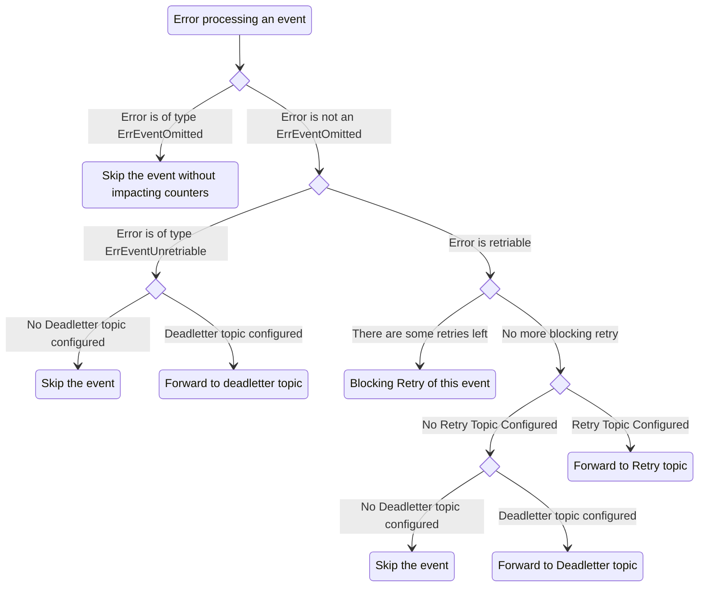

# GO-KAFKA

[](https://travis-ci.org/ricardo-ch/go-kafka)
[](https://coveralls.io/github/ricardo-ch/go-kafka?branch=master)
[](https://goreportcard.com/report/github.com/ricardo-ch/go-kafka)

Go-kafka provides an easy way to use kafka listeners and producers with only a few lines of code.
The listener is able to consume from multiple topics, and will execute a separate handler for each topic.

## Quick start

Simple consumer
```golang
// topic-specific handlers
var handler1 kafka.Handler
var handler2 kafka.Handler

// map your topics to their handlers
handlers := map[string]kafka.Handler{
    "topic-1": handler1,
    "topic-2": handler2,
}

// define your listener
kafka.Brokers = []string{"localhost:9092"}
listener, _ := kafka.NewListener("my-consumer-group", handlers)
defer listener.Close()

// listen and enjoy
errc <- listener.Listen(ctx)
```

Simple producer
```golang
// define your producer
kafka.Brokers = []string{"localhost:9092"}
producer, _ := kafka.NewProducer()

// send your message
message := &sarama.ProducerMessage{
	Topic: "my-topic",
	Value: sarama.StringEncoder("my-message"),
}
_ = producer.Produce(message)
```

## Features

* Create a listener on multiple topics
* Retry policy on message handling
* Create a producer
* Prometheus instrumenting

## Consumer error handling

You can customize the error handling of the consumer.
And if there's still an error after all possible retries (3 by default), the error is logged and the faulty event can be pushed to a deadletter topic.

Here is the overall logic applied to handle errors:


### Deadletter

By default, events that have exceeded the maximum number of retries will be pushed to a dead letter topic.
This behaviour can be disabled through the `PushConsumerErrorsToTopic` property.
```go
PushConsumerErrorsToTopic = false
```
The name of the deadletter topic is dynamically generated based on the original topic name and the consumer group.
For example, if the original topic is `my-topic` and the consumer group is `my-consumer-group`, the deadletter topic will be `my-consumer-group-my-topic-error`.
This pattern can be overridden through the `ErrorTopicPattern` property.
```go
ErrorTopicPattern = "custom-deadletter-topic"
```

### Retries

By default, failed events consumptions will be retried 3 times (each attempt is separated by 2 seconds).
This can be configured through the following properties:
* `ConsumerMaxRetries`
* `DurationBeforeRetry`

If you want to achieve a blocking retry pattern (ie. continuously retrying until the event is successfully consumed), you can set `ConsumerMaxRetries` to `InfiniteRetries` (-1).

If you want to **not** retry specific errors, you can wrap them in a `kafka.ErrNonRetriable` error before returning them, or return a `kafka.ErrNonRetriable` directly.
```go
// This error will not be retried
err := errors.New("my error")
return errors.Wrap(kafka.ErrNonRetriable, err.Error())

// This error will also not be retried
return kafka.ErrNonRetriable
```

### Omitting specific errors

In certain scenarios, you might want to omit some errors. For example, you might want to discard outdated events that are not relevant anymore.
Such events would increase a separate, dedicated metric instead of the error one, and would not be retried.
To do so, wrap the errors that should lead to omitted events in a ErrEventOmitted, or return a kafka.ErrEventOmitted directly.
```go
// This error will be omitted
err := errors.New("my error")
return errors.Wrap(kafka.ErrEventOmitted, err.Error())

// This error will also be omitted
return kafka.ErrEventOmitted
```

## Instrumenting

Metrics for the listener and the producer can be exported to Prometheus.
The following metrics are available:
| Metric name | Labels | Description |
|-------------|--------|-------------|
| kafka_consumer_record_consumed_total | kafka_topic, consumer_group | Number of messages consumed |
| kafka_consumer_record_latency_seconds | kafka_topic, consumer_group | Latency of consuming a message |
| kafka_consumer_record_omitted_total | kafka_topic, consumer_group | Number of messages omitted |
| kafka_consumer_record_error_total | kafka_topic, consumer_group | Number of errors when consuming a message |
| kafka_consumergroup_current_message_timestamp| kafka_topic, consumer_group, partition, type | Timestamp of the current message being processed. Type can be either of `LogAppendTime` or `CreateTime`. |
| kafka_producer_record_send_total | kafka_topic | Number of messages sent |
| kafka_producer_dead_letter_created_total | kafka_topic | Number of messages sent to a dead letter topic |
| kafka_producer_record_error_total | kafka_topic | Number of errors when sending a message |

To activate the tracing on go-Kafka:

```golang
// define your listener
listener, _ := kafka.NewListener(brokers, "my-consumer-group", handlers, kafka.WithInstrumenting())
defer listener.Close()

// Instances a new HTTP server for metrics using prometheus 
go func() {
	httpAddr := ":8080" 
	mux.Handle("/metrics", promhttp.Handler())
	errc <- http.ListenAndServe(httpAddr, mux)
}()

```

## Default configuration

Configuration of consumer/producer is opinionated. It aim to resolve simply problems that have taken us by surprise in the past.
For this reason:
- the default partioner is based on murmur2 instead of the one sarama use by default
- offset retention is set to 30 days
- initial offset is oldest

## License

go-kafka is licensed under the MIT license. (http://opensource.org/licenses/MIT)

## Contributing

Pull requests are the way to help us here. We will be really grateful.
