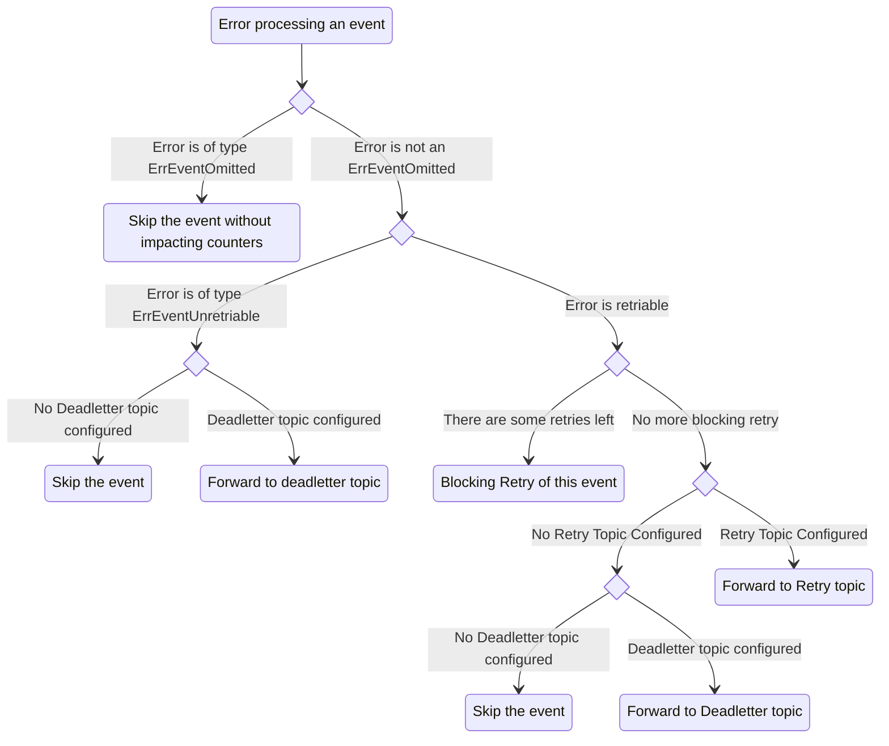

# GO-KAFKA


[](https://goreportcard.com/report/github.com/ricardo-ch/go-kafka)

Go-kafka provides an easy way to use kafka listeners and producers with only a few lines of code.
The listener is able to consume from multiple topics, and will execute a separate handler for each topic.

> 📘 Important note for v3 upgrade:
> - The library now relies on the IBM/sarama library instead of Shopify/sarama, which is no longer maintained.
> - The `kafka.Handler` type has been changed to a struct containing both the function to execute and the handler's optional configuration.
> - The global variable `PushConsumerErrorsToTopic` has been replaced by the `PushConsumerErrorsToRetryTopic` and `PushConsumerErrorsToDeadletterTopic` properties on the handler.
> - **Tracing**: OpenTracing has been replaced by OpenTelemetry (OTel). The propagation format is now W3C Trace Context (`traceparent`, `tracestate`) instead of Jaeger/OpenTracing format. Remove the `github.com/ricardo-ch/go-tracing` dependency; configure OTel in your application instead. 

## Quick start

Simple consumer
```golang
// topic-specific handlers
var handler1 kafka.Handler
var handler2 kafka.Handler

// map your topics to their handlers
handlers := map[string]kafka.Handler{
    "topic-1": handler1,
    "topic-2": handler2,
}

// define your listener
kafka.Brokers = []string{"localhost:9092"}
listener, _ := kafka.NewListener("my-consumer-group", handlers)
defer listener.Close()

// listen and enjoy
errc <- listener.Listen(ctx)
```

Simple producer
```golang
// define your producer
kafka.Brokers = []string{"localhost:9092"}
producer, _ := kafka.NewProducer()

// send your message
message := &sarama.ProducerMessage{
	Topic: "my-topic",
	Value: sarama.StringEncoder("my-message"),
}
_ = producer.Produce(message)
```

## Features

* Create a listener on multiple topics
* Retry policy on message handling
* Create a producer
* Prometheus instrumenting

## Consumer error handling

You can customize the error handling of the consumer, using various patterns:
* Blocking retries of the same event (Max number, and delay are configurable by handler)
* Forward to retry topic for automatic retry without blocking the consumer
* Forward to deadletter topic for manual investigation

Here is the overall logic applied to handle errors:

```mermaid
stateDiagram-v2

init: Error processing an event
state is_omitable_err <<choice>>
skipWithoutCounting: Skip the event without impacting counters
state is_retriable_err <<choice>>
state is_deadletter_configured <<choice>>
skip: Skip the event
forwardDL: Forward to deadletter topic
state should_retry <<choice>>
blocking_retry : Blocking Retry of this event
state is_retry_topic_configured <<choice>>
state is_deadletter_configured2 <<choice>>
forwardRQ: Forward to Retry topic
skip2: Skip the event
defaultDL: Forward to Deadletter topic

init --> is_omitable_err
is_omitable_err --> skipWithoutCounting: Error is of type ErrEventOmitted
is_omitable_err --> is_retriable_err: Error is not an ErrEventOmitted
is_retriable_err --> is_deadletter_configured: Error is of type ErrEventUnretriable
is_retriable_err --> should_retry: Error is retriable
should_retry --> blocking_retry: There are some retries left
should_retry --> is_retry_topic_configured : No more blocking retry
is_deadletter_configured --> skip: No Deadletter topic configured
is_deadletter_configured --> forwardDL: Deadletter topic configured
is_retry_topic_configured --> forwardRQ: Retry Topic Configured
is_retry_topic_configured --> is_deadletter_configured2: No Retry Topic Configured
is_deadletter_configured2 --> skip2: No Deadletter topic configured
is_deadletter_configured2 --> defaultDL: Deadletter topic configured 

```
### Error types

Two types of special errors are available to control message handling:
* **Unretriable errors** - Errors that should not be retried (sent to deadletter topic if configured)
* **Omitted errors** - Errors that should be silently dropped without impacting metrics

All other errors will be considered as "retryable" errors.

#### Using wrapper functions (recommended)

The simplest way to mark an error as unretriable or omitted:

```go
// This error will not be retried
return kafka.NewUnretriableError(errors.New("invalid payload format"))
return kafka.NewUnretriableError(fmt.Errorf("validation failed: %w", err))

// This error will be omitted (no retry, no deadletter, no metric impact)
return kafka.NewOmittedError(errors.New("duplicate message"))
return kafka.NewOmittedError(fmt.Errorf("outdated event from %s", eventTime))
```

The original error is preserved and can be unwrapped with `errors.Is()` or `errors.As()`.

#### Using custom error types

For reusable business errors, implement the `UnretriableError` or `OmittedError` interfaces:

```go
// Custom error that implements UnretriableError interface
type ValidationError struct {
    Field   string
    Message string
}

func (e ValidationError) Error() string       { return fmt.Sprintf("%s: %s", e.Field, e.Message) }
func (e ValidationError) IsUnretriable() bool { return true }

// Custom error that implements OmittedError interface
type OutdatedEventError struct {
    EventTime time.Time
}

func (e OutdatedEventError) Error() string   { return fmt.Sprintf("event from %s is outdated", e.EventTime) }
func (e OutdatedEventError) IsOmitted() bool { return true }

// Usage in handler
func myHandler(ctx context.Context, msg *sarama.ConsumerMessage) error {
    if !isValid(msg) {
        return ValidationError{Field: "user_id", Message: "required"}
    }
    if isOutdated(msg) {
        return OutdatedEventError{EventTime: msg.Timestamp}
    }
    return nil
}
```

This approach allows your errors to be detected across different versions of the library and provides better semantics.

Depending on the Retry topic/Deadletter topic/Max retries configuration, the event will be retried, forwarded to a retry topic, or forwarded to a deadletter topic.

### Blocking Retries

By default, failed events consumptions will be retried 3 times (each attempt is separated by 2 seconds) with no exponential backoff.
This can be globally configured through the following properties:
* `ConsumerMaxRetries` (int)
* `DurationBeforeRetry` (duration)

These properties can also be configured on a per-topic basis by setting the `ConsumerMaxRetries`, `DurationBeforeRetry` and `ExponentialBackoff` properties on the handler.

If you want to achieve a blocking retry pattern (ie. continuously retrying until the event is successfully consumed), you can set `ConsumerMaxRetries` to `InfiniteRetries` (-1).
 
#### exponential backoff 
You can activate it by setting `ExponentialBackoff` config variable as true. This configuration is useful in case of infinite retry configuration.

The exponential backoff uses `sarama.NewExponentialBackoff` which implements [KIP-580](https://cwiki.apache.org/confluence/display/KAFKA/KIP-580%3A+Exponential+Backoff+for+Kafka+Clients) with jitter to avoid "thundering herd" issues.

Configuration:
* `DurationBeforeRetry` (duration) - base duration between retries (default: 2s)
* `MaxBackoffDuration` (duration) - maximum backoff duration (default: 1m)
* `BackoffFunc` (optional) - custom backoff function per-handler: `func(retries, maxRetries int) time.Duration`

The backoff duration increases exponentially with jitter, capped at `MaxBackoffDuration`.

### Deadletter And Retry topics

By default, events that have exceeded the maximum number of blocking retries will be pushed to a retry topic or dead letter topic.
This behaviour can be disabled through the `PushConsumerErrorsToRetryTopic` and `PushConsumerErrorsToDeadletterTopic` properties.
```go
PushConsumerErrorsToRetryTopic = false
PushConsumerErrorsToDeadletterTopic = false
```
If these switches are ON, the names of the deadletter and retry topics are dynamically generated based on the original topic name and the consumer group.
For example, if the original topic is `my-topic` and the consumer group is `my-consumer-group`, the deadletter topic will be `my-consumer-group-my-topic-deadletter`.
This pattern can be overridden through the `ErrorTopicPattern` property.
Also, the retry and deadletter topics name can be overridden through the `RetryTopic` and `DeadLetterTopic` properties on the handler.

Note that, if global `PushConsumerErrorsToRetryTopic` or `PushConsumerErrorsToDeadletterTopic` property are false, but you configure `RetryTopic` or `DeadLetterTopic` properties on a handler, then the events in error will be forwarder to the error topics only for this handler.

### Omitting specific errors

In certain scenarios, you might want to omit some errors. For example, you might want to discard outdated events that are not relevant anymore.
Such events would increase a separate, dedicated metric instead of the error one, and would not be retried.
To do so, wrap the errors that should lead to omitted events in a ErrEventOmitted, or return a kafka.ErrEventOmitted directly.
```go
// This error will be omitted
err := errors.New("my error")
return errors.Wrap(kafka.ErrEventOmitted, err.Error())

// This error will also be omitted
return kafka.ErrEventOmitted
```

## Instrumenting

Metrics for the listener and the producer can be exported to Prometheus.
The following metrics are available:
| Metric name | Labels | Description |
|-------------|--------|-------------|
| kafka_consumer_record_consumed_total | kafka_topic, consumer_group | Number of messages consumed |
| kafka_consumer_record_latency_seconds | kafka_topic, consumer_group | Latency of consuming a message |
| kafka_consumer_record_omitted_total | kafka_topic, consumer_group | Number of messages omitted |
| kafka_consumer_record_error_total | kafka_topic, consumer_group | Number of errors when consuming a message |
| kafka_consumergroup_current_message_timestamp| kafka_topic, consumer_group, partition, type | Timestamp of the current message being processed. Type can be either of `LogAppendTime` or `CreateTime`. |
| kafka_producer_record_send_total | kafka_topic | Number of messages sent |
| kafka_producer_dead_letter_created_total | kafka_topic | Number of messages sent to a dead letter topic |
| kafka_producer_record_error_total | kafka_topic | Number of errors when sending a message |

To activate distributed tracing (OpenTelemetry) on go-Kafka:

```golang
// Configure OpenTelemetry in your application (TracerProvider, exporter, etc.)
// See https://opentelemetry.io/docs/languages/go/getting-started/

// Define your listener with tracing
listener, _ := kafka.NewListener("my-consumer-group", handlers,
	kafka.WithInstrumenting(),
	kafka.WithTracing(kafka.DefaultTracing),
)
defer listener.Close()

// Instances a new HTTP server for metrics using prometheus
go func() {
	httpAddr := ":8080"
	mux.Handle("/metrics", promhttp.Handler())
	errc <- http.ListenAndServe(httpAddr, mux)
}()
```

Tracing uses W3C Trace Context format (`traceparent`, `tracestate` headers). Use `GetKafkaHeadersFromContext` when producing messages to propagate the trace context.

## Logging

The library uses Go's standard `log/slog` package (Go 1.21+) for structured logging with levels.

### Log Levels

- **DEBUG**: Detailed information (message received, processed, committed)
- **INFO**: General operational information (listener started, session info, messages forwarded to retry/deadletter topics)
- **WARN**: Warning messages (retries, omitted messages, dropped messages)
- **ERROR**: Error messages (processing failures, panics, failed forwards)

### Configuration

By default, logging is set to `INFO` level with text format to stderr. You can change the level:

```golang
import "log/slog"

// Set log level to DEBUG for detailed output
kafka.SetLogLevel(slog.LevelDebug)

// Set log level to WARN to only see warnings and errors
kafka.SetLogLevel(slog.LevelWarn)
```

### Custom Logger

You can provide your own `slog.Logger` for full control over logging:

```golang
import "log/slog"

// JSON format (ideal for ELK, Datadog, etc.)
kafka.SetLogger(slog.New(slog.NewJSONHandler(os.Stdout, &slog.HandlerOptions{
    Level: slog.LevelDebug,
})))

// Custom handler with your logging infrastructure
kafka.SetLogger(slog.New(myCustomHandler))

// Disable logging
kafka.SetLogger(slog.New(slog.NewTextHandler(io.Discard, nil)))
```

### Lowercase log levels

By default, `slog` outputs log levels in uppercase (`INFO`, `WARN`, `ERROR`).
The default go-kafka logger already outputs lowercase levels, but if you provide a custom logger via `SetLogger()`, you need to opt-in explicitly.

Use the exported `LowercaseLevelAttr` helper as `ReplaceAttr` in your handler options:

```golang
kafka.SetLogger(slog.New(slog.NewJSONHandler(os.Stdout, &slog.HandlerOptions{
    Level:       slog.LevelInfo,
    ReplaceAttr: kafka.LowercaseLevelAttr,
})).With("component", "go-kafka"))
```

This produces `"level":"info"` instead of `"level":"INFO"`.

### Example Log Output

**Text format (default):**
```
time=2024-01-15T10:30:00.000Z level=INFO msg="starting listener" consumer_group=my-group topics="[orders events]"
time=2024-01-15T10:30:00.100Z level=WARN msg="message processing failed, will retry" topic=orders partition=0 offset=123 error="connection timeout" retry_number=1 remaining_retries=2 backoff_duration=2s
time=2024-01-15T10:30:02.100Z level=ERROR msg="message processing failed, applying error handling policy" topic=orders partition=0 offset=123 error="processing failed: connection timeout"
```

**JSON format:**
```json
{"time":"2024-01-15T10:30:00.000Z","level":"INFO","msg":"starting listener","consumer_group":"my-group","topics":["orders","events"]}
{"time":"2024-01-15T10:30:00.100Z","level":"WARN","msg":"message processing failed, will retry","topic":"orders","partition":0,"offset":123,"error":"connection timeout","retry_number":1}
```

## Default configuration

Configuration of consumer/producer is opinionated. It aims to resolve problems that have taken us by surprise in the past.
For this reason:
- **Kafka version** is set to `sarama.MaxVersion` (the latest version supported by sarama) to enable all available features
- **Partitioner** is based on murmur2 (JVM-compatible) instead of sarama's default
- **Offset retention** is set to 30 days
- **Initial offset** is set to oldest

You can override the Kafka version if needed:
```golang
kafka.Config.Version = sarama.V2_1_0_0 // or any specific version
```

## License

go-kafka is licensed under the MIT license. (http://opensource.org/licenses/MIT)

## Contributing

Pull requests are the way to help us here. We will be really grateful.
