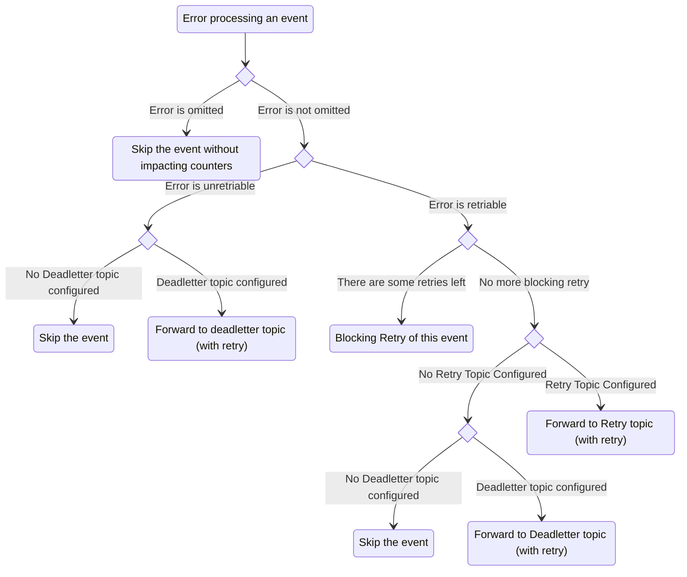

# GO-KAFKA


[](https://goreportcard.com/report/github.com/ricardo-ch/go-kafka)

Go-kafka provides an easy way to use kafka listeners and producers with only a few lines of code.
The listener is able to consume from multiple topics, and will execute a separate handler for each topic.

> **v4 breaking changes** — see [Migration Guide (v3 → v4)](MIGRATION.md) for full details and checklist:
> - **Tracing**: OpenTracing replaced by OpenTelemetry (OTel). W3C Trace Context (`traceparent`, `tracestate`) instead of Jaeger. Remove `github.com/ricardo-ch/go-tracing`
> - `Producer.Produce` now requires a `context.Context` as first argument: `Produce(ctx, msg)`
> - `SetLogger`, `SetLogLevel`, `LowercaseLevelAttr` removed — use `slog.SetDefault()` instead
> - `ExponentialBackoffFunc` is now `nil` by default (evaluated lazily using current `DurationBeforeRetry`/`MaxBackoffDuration`)
> - `MaxBackoffDuration` default changed from 1m to 10m
> - New `ForwardMaxBackoffDuration` global variable (default: 30s) — retry/deadletter forwarding now retries on producer failure
> - New `WithLogContextStorer` option for context-aware structured logging

## Quick start

Simple consumer
```go
handlers := map[string]kafka.Handler{
    "topic-1": handler1,
    "topic-2": handler2,
}

kafka.Brokers = []string{"localhost:9092"}
listener, _ := kafka.NewListener("my-consumer-group", handlers)
defer listener.Close()

errc <- listener.Listen(ctx)
```

Simple producer
```go
kafka.Brokers = []string{"localhost:9092"}
producer, _ := kafka.NewProducer()

message := &sarama.ProducerMessage{
    Topic: "my-topic",
    Value: sarama.StringEncoder("my-message"),
}
_ = producer.Produce(ctx, message)
```

## Features

- Multi-topic consumer with per-topic handlers
- Blocking retry with configurable count, backoff, and exponential backoff (KIP-580 with jitter)
- Automatic forwarding to retry/deadletter topics with guaranteed delivery (retry on producer failure)
- Error classification: retriable, unretriable, omitted
- Topic collision detection (`ErrRetryTopicCollision`, `ErrDeadletterTopicCollision`)
- Prometheus metrics for consumer and producer
- OpenTelemetry tracing (W3C Trace Context)
- Context-aware structured logging via `slog`

## Consumer error handling

You can customize the error handling of the consumer, using various patterns:
- Blocking retries of the same event (max number and delay are configurable per handler)
- Forward to retry topic for automatic retry without blocking the consumer
- Forward to deadletter topic for manual investigation

Forwarding to retry/deadletter topics is **guaranteed**: if the producer fails, the library retries with exponential backoff (capped by `ForwardMaxBackoffDuration`) until the message is published or the context is cancelled.

Here is the overall logic applied to handle errors:

```mermaid
stateDiagram-v2

init: Error processing an event
state is_omitable_err <<choice>>
skipWithoutCounting: Skip the event without impacting counters
state is_retriable_err <<choice>>
state is_deadletter_configured <<choice>>
skip: Skip the event
forwardDL: Forward to deadletter topic (with retry)
state should_retry <<choice>>
blocking_retry : Blocking Retry of this event
state is_retry_topic_configured <<choice>>
state is_deadletter_configured2 <<choice>>
forwardRQ: Forward to Retry topic (with retry)
skip2: Skip the event
defaultDL: Forward to Deadletter topic (with retry)

init --> is_omitable_err
is_omitable_err --> skipWithoutCounting: Error is omitted
is_omitable_err --> is_retriable_err: Error is not omitted
is_retriable_err --> is_deadletter_configured: Error is unretriable
is_retriable_err --> should_retry: Error is retriable
should_retry --> blocking_retry: There are some retries left
should_retry --> is_retry_topic_configured : No more blocking retry
is_deadletter_configured --> skip: No Deadletter topic configured
is_deadletter_configured --> forwardDL: Deadletter topic configured
is_retry_topic_configured --> forwardRQ: Retry Topic Configured
is_retry_topic_configured --> is_deadletter_configured2: No Retry Topic Configured
is_deadletter_configured2 --> skip2: No Deadletter topic configured
is_deadletter_configured2 --> defaultDL: Deadletter topic configured 

```

### Error types

Two types of special errors are available to control message handling:
- **Unretriable errors** — Errors that should not be retried (sent to deadletter topic if configured)
- **Omitted errors** — Errors that should be silently dropped without impacting metrics

All other errors are considered **retriable**.

Each error is logged with an `error_type` field (`"retriable"`, `"unretriable"`, or `"omitted"`). Retriable errors also include a `stack` trace for debugging.

#### Using wrapper functions (recommended)

```go
// This error will not be retried, but forwarded to deadletter
return kafka.NewUnretriableError(errors.New("invalid payload format"))
return kafka.NewUnretriableError(fmt.Errorf("validation failed: %w", err))

// This error will be omitted (no retry, no deadletter, no metric impact)
return kafka.NewOmittedError(errors.New("duplicate message"))
return kafka.NewOmittedError(fmt.Errorf("outdated event from %s", eventTime))
```

The original error is preserved and can be unwrapped with `errors.Is()` or `errors.As()`.

#### Using custom error types

For reusable business errors, implement the `UnretriableError` or `OmittedError` interfaces:

```go
type ValidationError struct {
    Field   string
    Message string
}

func (e ValidationError) Error() string       { return fmt.Sprintf("%s: %s", e.Field, e.Message) }
func (e ValidationError) IsUnretriable() bool { return true }

type OutdatedEventError struct {
    EventTime time.Time
}

func (e OutdatedEventError) Error() string   { return fmt.Sprintf("event from %s is outdated", e.EventTime) }
func (e OutdatedEventError) IsOmitted() bool { return true }
```

#### Sentinel errors

```go
// Sentinel errors for direct use
kafka.ErrEventUnretriable
kafka.ErrEventOmitted

// Wrap with context
return fmt.Errorf("bad payload: %w", kafka.ErrEventUnretriable)
```

#### Topic collision detection

`NewListener` returns an error if a handler's retry or deadletter topic collides with its consumed topic, preventing infinite loops:
- `ErrRetryTopicCollision` — retry topic matches the consumed topic
- `ErrDeadletterTopicCollision` — deadletter topic matches the consumed topic

### Blocking Retries

By default, failed events are retried 3 times with a 2-second delay and no exponential backoff. The backoff is capped by `MaxBackoffDuration` (default: 10 minutes).

Global configuration:
- `ConsumerMaxRetries` (int) — default: `3`, set to `InfiniteRetries` (`-1`) for blocking retry
- `DurationBeforeRetry` (duration) — default: `2s`
- `MaxBackoffDuration` (duration) — default: `10m`, caps both fixed and exponential backoff

Per-handler override via `HandlerConfig`:
- `ConsumerMaxRetries`, `DurationBeforeRetry`, `ExponentialBackoff`
- `BackoffFunc` — custom backoff function: `func(retries, maxRetries int) time.Duration`

#### Exponential backoff

Activate with `ExponentialBackoff: true` on the handler config. Uses `sarama.NewExponentialBackoff` which implements [KIP-580](https://cwiki.apache.org/confluence/display/KAFKA/KIP-580%3A+Exponential+Backoff+for+Kafka+Clients) with jitter.

`ExponentialBackoffFunc` is `nil` by default and evaluated lazily using the current values of `DurationBeforeRetry` and `MaxBackoffDuration`. Set it to a custom function to override the default strategy globally:

```go
kafka.ExponentialBackoffFunc = func(retries, maxRetries int) time.Duration {
    return time.Duration(retries+1) * time.Second
}
```

Priority order for backoff calculation:
1. Handler's `BackoffFunc` (per-handler)
2. Global `ExponentialBackoffFunc` (if set)
3. Lazy `sarama.NewExponentialBackoff(DurationBeforeRetry, MaxBackoffDuration)`

### Retry and Deadletter topics

By default, events that have exceeded the maximum number of blocking retries are forwarded to a retry or deadletter topic. Forwarding retries on producer failure with exponential backoff (capped by `ForwardMaxBackoffDuration`, default: 30s) until the message is published or the context is cancelled.

If no custom topic is configured on the handler, the retry and deadletter topic names are **automatically generated** from patterns using `$$CG$$` (consumer group) and `$$T$$` (topic) placeholders:
- `RetryTopicPattern` — default: `$$CG$$-$$T$$-retry`
- `DeadletterTopicPattern` — default: `$$CG$$-$$T$$-deadletter`

For example, with topic `orders` and consumer group `my-app`, the generated topics are `my-app-orders-retry` and `my-app-orders-deadletter`.

Override per handler:
```go
kafka.Handler{
    Processor: myHandler,
    Config: kafka.HandlerConfig{
        RetryTopic:      "my-custom-retry-topic",
        DeadletterTopic: "my-custom-deadletter-topic",
    },
}
```

Disable forwarding globally:
```go
kafka.PushConsumerErrorsToRetryTopic = false
kafka.PushConsumerErrorsToDeadletterTopic = false
```

If global forwarding is disabled but a handler has a custom retry/deadletter topic configured, forwarding is enabled for that handler only.

## Instrumenting

Metrics for the listener and the producer can be exported to Prometheus.

| Metric name | Labels | Description |
|-------------|--------|-------------|
| `kafka_consumer_record_consumed_total` | `kafka_topic`, `consumer_group` | Number of messages consumed |
| `kafka_consumer_record_latency_seconds` | `kafka_topic`, `consumer_group` | Latency of consuming a message |
| `kafka_consumer_record_omitted_total` | `kafka_topic`, `consumer_group` | Number of messages omitted |
| `kafka_consumer_record_error_total` | `kafka_topic`, `consumer_group` | Number of errors (after all retries exhausted) |
| `kafka_consumergroup_current_message_timestamp` | `kafka_topic`, `consumer_group`, `partition`, `type` | Timestamp of the current message (`LogAppendTime` or `CreateTime`) |
| `kafka_producer_record_send_total` | `kafka_topic` | Number of messages sent |
| `kafka_producer_record_send_latency_seconds` | `kafka_topic` | Latency of sending a message |
| `kafka_producer_dead_letter_created_total` | `kafka_topic` | Number of deadletter messages created |
| `kafka_producer_record_error_total` | `kafka_topic` | Number of send errors |

### Enabling metrics and tracing

```go
listener, _ := kafka.NewListener("my-consumer-group", handlers,
    kafka.WithInstrumenting(),
    kafka.WithTracing(kafka.DefaultTracing),
)
defer listener.Close()

go func() {
    mux := http.NewServeMux()
    mux.Handle("/metrics", promhttp.Handler())
    errc <- http.ListenAndServe(":8080", mux)
}()
```

Tracing uses W3C Trace Context format (`traceparent`, `tracestate` headers). When producing messages, use `GetKafkaHeadersFromContext` to propagate the trace context:

```go
headers := kafka.GetKafkaHeadersFromContext(ctx)
msg := &sarama.ProducerMessage{
    Topic:   "my-topic",
    Value:   sarama.StringEncoder("payload"),
    Headers: headers,
}
producer.Produce(ctx, msg)
```

## Logging

The library uses Go's standard `log/slog` package for structured logging. It calls `slog.Default()` directly — configure logging via `slog.SetDefault()` in your application.

### Log field naming

Library-emitted structured log fields use `camelCase` by default. You can switch them to `snake_case` during application startup:

```go
kafka.LogFormat = kafka.LogFieldFormatSnakeCase
```

Set this before creating any `Listener` or `Producer`.

### Log levels

- **DEBUG**: Message received, processed, committed, session lifecycle
- **INFO**: Listener started, handler config, messages forwarded to retry/deadletter
- **WARN**: Retries, omitted messages, dropped messages, unretriable errors
- **ERROR**: Processing failures, panics (with stack trace)

### Kafka message context in logs (`WithLogContextStorer`)

When processing a message, the library creates a `*slog.Logger` enriched with Kafka metadata as a structured `"kafka"` group. The library uses this enriched logger internally for all message-processing logs.

You can opt in to receive this logger in your handler's context via `WithLogContextStorer`:

```go
type LogContextStorer func(ctx context.Context, logger *slog.Logger) context.Context
```

Example setup:

```go
listener, err := kafka.NewListener(appName, handlers,
    kafka.WithLogContextStorer(myToContext),
)
```

Example handler:

```go
func myHandler(ctx context.Context, msg *sarama.ConsumerMessage) error {
    myFromContext(ctx).Info("processing order", "orderId", orderID)
    return nil
}
```

Output (JSON):

```json
{"level":"INFO","msg":"processing order","kafka":{"topic":"orders","consumerGroup":"my-group","partition":0,"offset":42},"orderId":"abc-123"}
```

The `LogContextStorer` is agnostic — provide your own `ToContext`/`FromContext` helpers or use a library like `slogr`. See `example/` for a complete implementation.

## Resource cleanup

`Close()` must be called to avoid goroutine leaks. It is **idempotent** (safe for multiple calls) and releases all resources:
- Closes the internal error-draining goroutine
- Closes the internal deadletter producer
- Closes the consumer group

```go
listener, _ := kafka.NewListener("my-group", handlers)
defer listener.Close()
```

## Default configuration

Configuration of consumer/producer is opinionated:
- **Kafka version**: `sarama.MaxVersion` (latest supported by sarama)
- **Partitioner**: murmur2 (JVM-compatible) instead of sarama's default
- **Offset retention**: 30 days
- **Initial offset**: oldest
- **Producer acks**: `WaitForAll`

Override the Kafka version if needed:
```go
kafka.Config.Version = sarama.V2_1_0_0
```

## License

go-kafka is licensed under the MIT license. (http://opensource.org/licenses/MIT)

## Contributing

Pull requests are the way to help us here. We will be really grateful.
